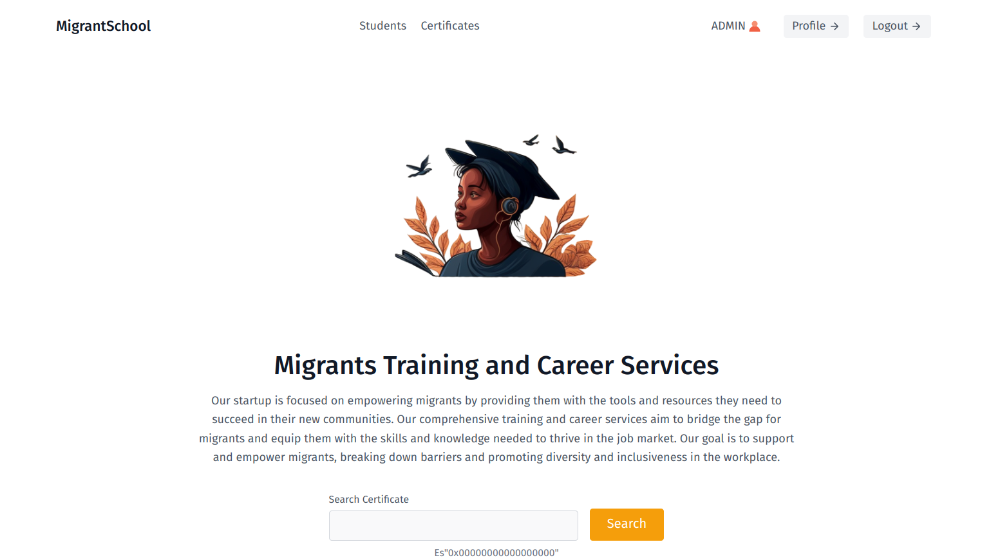
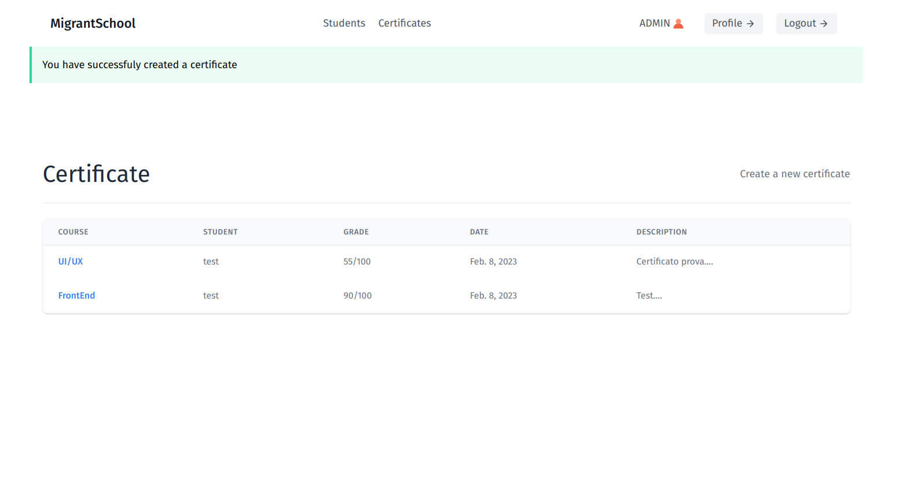
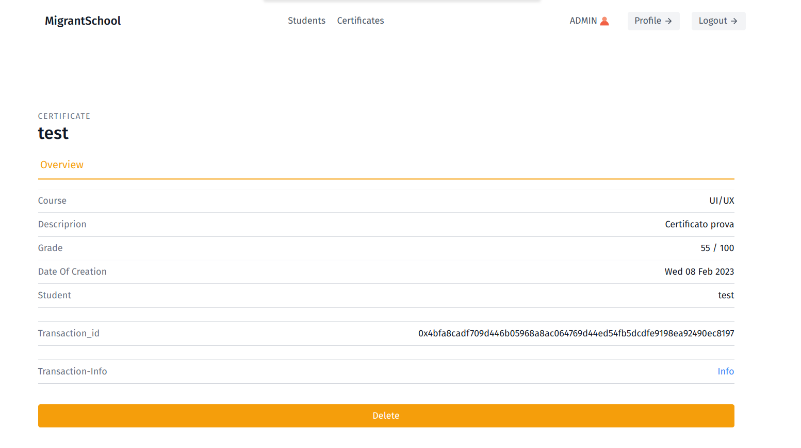
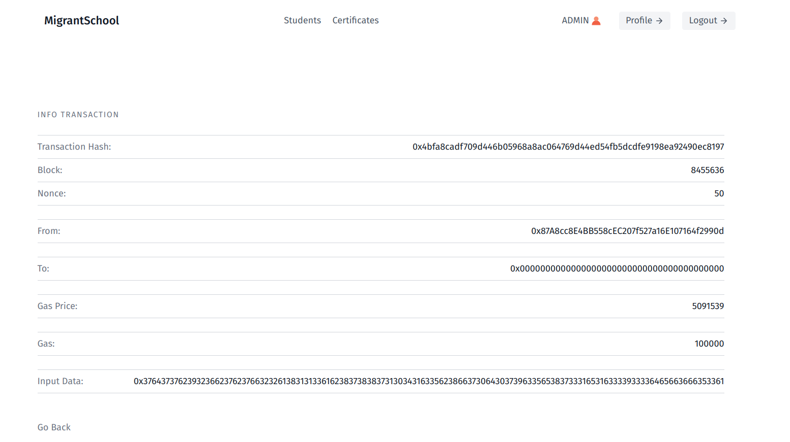
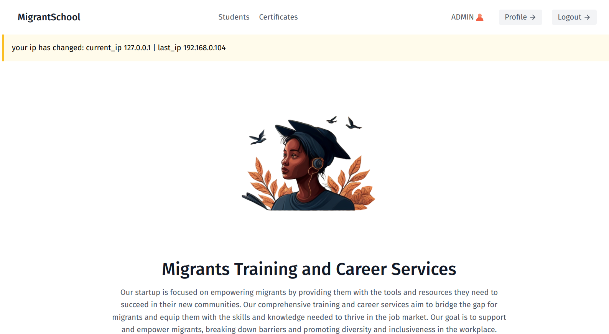

# MigrantSchool
- MigrantSchool is a web platform for generating educational certificates for migrants, with proof stored on the blockchain. Each certificate is securely recorded on the blockchain through a transaction.
<a href="https://demo1.isaccobertoli.com/">Try Demo</a>

## Requirements:

- A page, which only administrators can access, where it is possible to assign a degree to a student.

    

- A page that anyone can access and enter the identification code of a degree to view all the associated      information and transaction.

    
    
    
    

- A logging system to store the last IP that accessed the platform for a certain administrator user, in order to display a warning message when this is different from the previous one.

    

## Deployment

To deploy this project:
- Create a Virtual Environment
- Clone the repo and install requirements.txt
- Install and run the Redis DB server
- Make database migrations
- > `python manage.py runserver`.
- open `http://127.0.0.1:8000/` in browser

## Skills
Django, Redis, Goerli Testnet Python, HTML, CSS

## 🔗 Links

 
<a href="https://demo1.isaccobertoli.com/">Try Demo</a>
